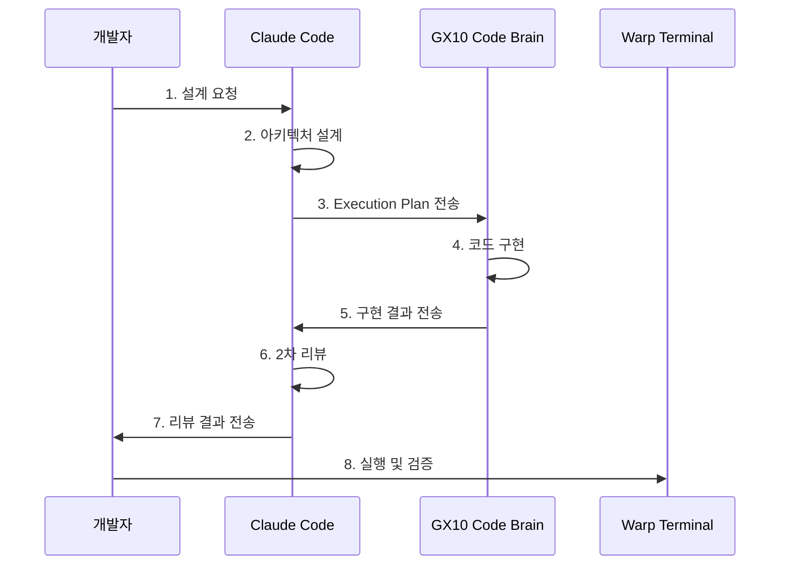
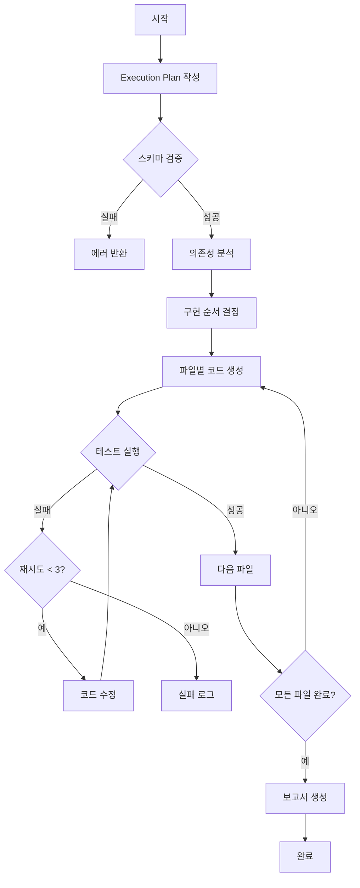
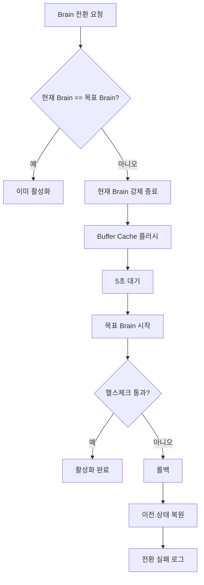

# Product Requirements Document (PRD)

## 문서 메타데이터
- **문서 ID**: DOC-PRD-001
- **버전**: 1.0
- **상태**: DRAFT → REVIEW
- **작성일**: 2026-02-01
- **마지막 수정**: 2026-02-01

## Status
- Overall: COMPLETE
- Executive Summary: COMPLETE
- Feature Mapping: COMPLETE
- Technical Approach: COMPLETE
- Implementation Plan: COMPLETE

## Table of Contents
1. [Executive Summary](#executive-summary)
2. [Product Vision](#product-vision)
3. [Requirements Mapping (MRD → PRD → PRS)](#requirements-mapping)
4. [Functional Requirements](#functional-requirements)
5. [User Stories](#user-stories)
6. [Technical Approach](#technical-approach)
7. [Architecture Decisions](#architecture-decisions)
8. [Implementation Phases](#implementation-phases)
9. [Success Metrics](#success-metrics)
10. [Non-Goals](#non-goals)
11. [Assumptions and Constraints](#assumptions-and-constraints)
12. [Open Features](#open-features)

---

## Executive Summary

GX10 프로젝트는 **장기 유지보수가 가능한 고품질 코드 생산**을 최우선 목표로 하는 로컬 AI 개발 환경 시스템입니다. 클라우드 구독형 AI 코딩 도구(GitHub Copilot, Claude Code, Cursor)의 높은 비용과 제어 불가능성을 해결하기 위해, ASUS GX10 하드웨어와 로컬 LLM을 활용한 완전히 제어 가능한 에이전트 코딩 시스템을 구축합니다.

### 핵심 문제 해결

**1. 비용 문제 해결**
- 월간 구독비 $0 (일회성 하드웨어 투자만)
- 대규모 팀 사용 시 연간 수천만 원 비용 절감

**2. 코드 품질 보장**
- TRUST 5 품질 기준 준수 (Tested, Readable, Unified, Secured, Trackable)
- Execution Plan 기반 결정론적 코드 생성
- Claude Code 2차 리뷰로 품질 검증

**3. 완전한 제어 가능성**
- Execution Plan을 통한 명시적 작업 지시
- 임의 판단(Arbitrary Decision) 금지
- 동일 Plan → 동일 출력 재현성 보장

### 핵심 차별화 포인트

| 특성 | 클라우드 AI 도구 | GX10 System |
|------|-----------------|-------------|
| 구독 비용 | $10-20/월 | $0 (일회성 $3,000-5,000) |
| 코드 품질 | ⚠️ 일관성 부족 | ✅ Execution Plan 기반 통제 |
| 제어 가능성 | ❌ 불가 | ✅ 완전 제어 |
| 오프라인 | ❌ 불가 | ✅ 가능 |
| 프라이버시 | ❌ 클라우드 전송 | ✅ 로컬 전용 |
| 진화 가능성 | ❌ 불가 | ✅ Idle Improvement |

### 제품 구조

GX10 시스템은 **Two Brain Architecture**를 기반으로 작동합니다:

1. **Code Brain**: Execution Plan을 기반으로 코드 구현을 끝까지 책임지는 엔진
2. **Vision Brain**: 영상처리 알고리즘 성능 검증 및 실험 엔진

두 Brain은 동시에 실행될 수 없으며, 상황에 따라 전환하여 사용합니다.

---

## Product Vision

**Vision Statement**: 제어 가능한 AI 자동화와 장기 유지보수가 가능한 고품질 코드 생산을 통해, 개발자는 창의적인 설계에 집중하고 반복적 구현은 GX10 시스템에 위임하는 개발 패러다임을 구현합니다.

### 핵심 가치 제안

1. **Quality-First Architecture**
   - 코드 품질이 개발 속도보다 우선
   - TRUST 5 품질 기준 준수 (Tested, Readable, Unified, Secured, Trackable)
   - 장기 유지보수성 보장

2. **Controlled Autonomy**
   - Execution Plan을 통한 완전한 제어
   - 임의 판단(Arbitrary Decision) 금지
   - 결정론적 출력 보장

3. **Cost-Effective Operation**
   - 일회성 하드웨어 투자
   - 월간 구독비 $0
   - 오프라인 작업 가능

4. **Continuous Evolution**
   - Idle Improvement로 지속적 모델 개선
   - 프로젝트 특정 요구사항에 맞는 커스터마이징

---

## Requirements Mapping

### MRD → PRD → PRS 매핑 테이블

이 테이블은 시장 요구사항(MRD)을 제품 요구사항(PRD)으로 변환하고, 이를 다시 제품 요구사항 명세(PRS)로 상세화하는 과정을 보여줍니다.

| MRD (Market Requirements) | PRD (Product Requirements) | PRS (Product Requirements Specification) |
|---------------------------|---------------------------|----------------------------------------|
| **MR-1: 구독 비용 최소화** | **PG-1: 비용 효율성** - 일회성 하드웨어 비용 - 월간 구독료 $0 - 오프라인 작업 가능 | **FR-PRS-3: 외부 제어 지원** - REST API 제공 - CI/CD 연동 |
| **MR-2: 코드 품질 우선** | **PG-1: 코드 품질 최우선** - TRUST 5 기준 준수 - 85%+ 커버리지 - 리팩토링 내성 테스트 | **FR-PRS-1: Execution Plan 기반 코드 생성** - 파일별 구현 - 테스트 자동 생성 - 재시도 메커니즘 **FR-PRS-2: 설계와 실행 분리** - 임의 판단 금지 - 명시적 제약 조건 준수 |
| **MR-3: 제어 가능성** | **PG-4: Execution Plan 시스템** - JSON/YAML 스키마 - 파일별 책임 명시 - 재현성 보장 | **FR-PRS-1.2**: 파일별 책임에 따른 코드 생성 **FR-PRS-2.1**: 임의 판단 금지 **NFR-PRS-6**: 결정론적 동작 |
| **MR-4: 자동화 파이프라인 지원** | **PG-5: 자동화 파이프라인 지원** - REST API - Webhook 지원 - 상태 조회 | **FR-PRS-3: 외부 제어 지원** - Brain 상태 조회 API - Brain 전환 API - 작업 실행 및 상태 조회 API |
| **MR-5: 진화 가능성** | **PG-6: Idle Improvement** - 실행 결과 학습 - 피드백 반영 - LoRA 파인튜닝 | **FR-PRS-5: Idle Improvement** - Code Brain 개선 - Vision Brain 개선 - 개선 작업 중단 가능성 |

### PRD Product Goals 상세 매핑

| PRD Product Goal | 관련 MRD | 관련 PRS | 성공 기준 |
|-----------------|---------|---------|----------|
| **PG-1: 코드 품질 최우선** | MR-2 | FR-PRS-1, FR-PRS-2, NFR-PRS-5 | - TRUST 5 준수율: 100% - 코드 커버리지: 85%+ - 리팩토링 내성: 100% |
| **PG-2: Two Brain 아키텍처** | MR-2, MR-3 | FR-PRS-4, NFR-PRS-2 | - 단일 Brain 실행 - 전환 시간 < 30초 - Code Brain: 50-60GB - Vision Brain: 70-90GB |
| **PG-3: Agent Coding 파이프라인** | MR-2, MR-3 | FR-PRS-1, FR-PRS-3 | - Claude Code → GX10 → Claude Code → Warp - Execution Plan 기반 - 2차 리뷰 통과 |
| **PG-4: Execution Plan 시스템** | MR-3 | FR-PRS-1, FR-PRS-2, DR-PRS-1 | - JSON/YAML 스키마 - 파일별 책임 명시 - 재현성 100% |
| **PG-5: 자동화 파이프라인 지원** | MR-4 | FR-PRS-3, IR-PRS-2 | - Brain 상태 조회 API - Brain 전환 API - 작업 실행/상태 조회 API |
| **PG-6: Idle Improvement** | MR-5 | FR-PRS-5 | - 실행 결과 학습 - 테스트 피드백 반영 - LoRA 파인튜닝 지원 |

---

## Functional Requirements

### 1. Code Brain (코드 생성 엔진)

**설명**: Execution Plan을 입력받아 코드 구현을 끝까지 책임지는 로컬 실행 엔진.

**주요 기능**:
- 디렉토리 생성
- 파일 생성 및 수정
- 다파일 동시 구현
- 테스트 실패 시 재수정 (최대 3회)
- 리팩토링
- 컨텍스트 유지 (128K 토큰)

**기술 사양**:
- Native 실행 (Docker 오버헤드 회피)
- Ollama + Qwen2.5-Coder-32B (메인)
- Ollama + Qwen2.5-Coder-7B (빠른 응답)
- DeepSeek-Coder-V2-16B (수학/논리)
- **메모리: 50-60GB** (권장, Option A: 공격적 확장)
  - qwen2.5-coder:32b: 24GB (16K KV Cache)
  - qwen2.5-coder:7b: 5GB (상시 로드)
  - deepseek-coder-v2:16b: 10GB (on-demand)
  - Ollama 오버헤드: 4GB
- 보수적 설정: 40-45GB (단일 모델 + on-demand 서브 모델)

**하지 않는 작업**:
- 요구사항 해석 ❌
- 아키텍처 설계 ❌
- 임의 판단 ❌

### 2. Vision Brain (검증 엔진)

**설명**: 영상처리 알고리즘의 성능을 검증하고 실험하는 엔진.

**주요 기능**:
- CUDA / TensorRT 실험
- latency / throughput 측정
- 성능 리포트 생성
- 모델 비교 검증

**기술 사양**:
- Docker 실행 (의존성 관리)
- Qwen2.5-VL-72B (고품질 분석)
- Qwen2.5-VL-7B (빠른 확인)
- YOLOv8x (Object Detection)
- SAM2-Large (Segmentation)
- Depth-Anything-V2 (Depth Estimation)
- 메모리: 70-90GB

**판단 기준**:
- 성능 재현성
- 수치 안정성
- 파라미터 영향
- 하드웨어 효율

### 3. Brain 전환 시스템 (Brain Switching System)

**설명**: Code Brain과 Vision Brain을 상황에 따라 전환하는 시스템.

**전환 절차**:
1. 현재 Brain 상태 조회
2. 요청 작업과 Brain 적합성 검사
3. 불일치 시 경고 및 Brain 전환
4. Buffer Cache 플러시 (필수!)
5. 목표 Brain 시작
6. 헬스체크 통과 후 실행

**기술 제약**:
- 단일 Brain만 실행 가능
- Code + Vision 동시 실행 금지
- 전환 시 Buffer Cache 플러시 필수

### 4. Execution Plan 인터페이스 (Execution Plan Interface)

**설명**: 개발자 PC 또는 상위 AI(Claude Code)가 작성하는 계획서.

**필수 포함 항목**:
- 프로젝트 이름, 버전
- 루트 디렉토리
- 제약 조건 (언어, 프레임워크, 스타일 가이드)
- 파일 목록 (경로, 책임, 의존성, 테스트 타겟)
- 구현 순서
- 테스트 기준 (명령, 성공 조건, 재시도 정책)
- 품질 게이트 (커버리지, 금지 패턴)

**스키마**: JSON Schema v1.0 (GX10-06-Comprehensive-Guide.md 참조)

### 5. REST API (REST API)

**설명**: 외부 시스템(CI/CD, MCP, n8n)에서 GX10을 제어하는 API.

**주요 엔드포인트**:
- `GET /api/brain/status`: Brain 상태 조회
- `POST /api/brain/switch`: Brain 전환
- `POST /api/task/execute`: 작업 제출
- `GET /api/task/{task_id}`: 작업 상태 조회

**인증**: JWT Bearer Token

**역할 기반 접근 제어 (RBAC)**:
- developer: 작업 제출, 상태 조회
- data_scientist: Vision Brain 전환, 벤치마크 실행
- admin: 모든 API 접근
- ci_cd: 작업 제출 (긴 timeout)

### 6. Idle Improvement (Idle Improvement)

**설명**: 외부 작업 지시가 없을 때 GX10이 자동으로 모델 성능을 향상.

**Code Brain 개선**:
- 실행 결과 수집
- 테스트 실패/성공 패턴 학습
- Claude 리뷰 피드백 반영
- 리팩토링 전/후 비교
- LoRA / QLoRA 기반 업데이트

**Vision Brain 개선**:
- 성능 실험 재분석
- 파라미터-성능 관계 학습
- CUDA / TRT 최신 기법 리서치

**우선순위**:
1. 외부 작업 지시 최우선
2. Idle Improvement는 즉시 중단 가능
3. 작업 종료 후 결과는 학습 데이터로 저장

### 7. Open WebUI (Open WebUI)

**설명**: Ollama와 통합된 웹 기반 채팅 인터페이스.

**기능**:
- Code Brain과 대화형 상호작용
- 코드 조각 테스트
- 빠른 프로토타이핑

**접속**: `http://<gx10-ip>:8080`

### 8. n8n 연동 (n8n Integration)

**설명**: 무인 자동화 워크플로우 도구와 통합.

**사용 시나리오**:
- GitHub Push → Code Brain 실행
- 주기적 성능 벤치마크
- 알림 및 보고

**접속**: `http://<gx10-ip>:5678`

---

## User Stories

### US-1: 시니어 개발자 - 신규 서비스 개발

**As a** 시니어 개발자
**I want to** Execution Plan을 작성하여 GX10에 코드 구현을 위임
**So that** 나는 아키텍처 설계와 코드 리뷰에 집중할 수 있다

**Acceptance Criteria**:
- Execution Plan YAML 파일 작성
- GX10 API에 작업 제출
- 구현된 코드 수신
- Claude Code로 2차 리뷰
- 테스트 통과 확인

**Priority**: P0 (필수)

### US-2: 연구 엔지니어 - 모델 성능 검증

**As a** 연구 엔지니어
**I want to** Vision Brain을 활성화하여 YOLO 모델 성능을 비교
**So that** 최적의 모델을 선택할 수 있다

**Acceptance Criteria**:
- Vision Brain 전환 (`/gx10/api/switch.sh vision`)
- 벤치마크 Execution Plan 작성
- 작업 제출 및 결과 수신
- Jupyter Notebook에서 결과 시각화

**Priority**: P0 (필수)

### US-3: DevOps 엔지니어 - CI/CD 통합

**As a** DevOps 엔지니어
**I want to** GitHub Webhook을 통해 GX10 Code Brain을 자동 실행
**So that** 코드 푸시 시 자동으로 리팩토링된 코드를 받을 수 있다

**Acceptance Criteria**:
- GitHub Webhook 설정
- n8n 워크플로우 구성
- GX10 API 연동
- Slack에 결과 알림

**Priority**: P1 (중요)

### US-4: 테크리드 - 코드 품질 검증

**As a** 테크리드
**I want to** 팀이 작성한 Execution Plan을 검토하고 GX10 결과를 확인
**So that** 코드 품질 기준을 준수하는지 확인할 수 있다

**Acceptance Criteria**:
- Execution Plan 리뷰
- 생성된 코드 검토
- 테스트 커버리지 확인
- Claude Code 리뷰 의견 확인

**Priority**: P0 (필수)

---

## Technical Approach

### 1. Agent Coding 파이프라인

GX10 시스템은 4단계 파이프라인으로 작동합니다:

### 2. Two Brain 아키텍처

**Code Brain (코딩 실행)**:
- 목적: Execution Plan 기반 코드 구현
- 실행 모드: Native (Docker 없음)
- 주요 모델: Qwen2.5-Coder-32B
- 메모리: 50-60GB (권장)
- 특징: 빠른 전환, 낮은 오버헤드

**Vision Brain (검증 실행)**:
- 목적: 영상처리 알고리즘 실험
- 실행 모드: Docker (의존성 관리)
- 주요 모델: Qwen2.5-VL-72B, YOLOv8x
- 메모리: 70-90GB
- 특징: 격리된 환경, 재현성 보장

### 3. Execution Plan 워크플로우

### 4. 메모리 최적화 전략 (GX10-08 반영)

**Code Brain 메모리 구성 (Option A: 공격적 확장)**:
- 총 메모리: 50-60GB
- 구성:
  - qwen2.5-coder:32b (메인): 24GB (16K KV Cache)
  - qwen2.5-coder:7b (서브): 5GB (상시 로드)
  - deepseek-coder-v2:16b (수학/논리): 10GB (on-demand)
  - Ollama 오버헤드: 4GB
  - 버퍼: 7-17GB

**장점**:
- 메인 모델의 큰 컨텍스트 윈도우 활용 (16K KV Cache)
- 서브 모델로 빠른 질문 응답
- 복잡한 수학/논리 작업 전용 모델
- 유연한 모델 스위칭

**보수적 설정 (단일 모델)**:
- 총 메모리: 40-45GB
- qwen2.5-coder:32b만 로드 (24GB)
- on-demand로 다른 모델 로드
- 더 안정적인 운영

### 5. Brain 전환 프로세스

### 6. 자동화 파이프라인 통합

**CI/CD 통합**:
- GitHub Webhook → n8n → GX10 API
- Pull Request 생성 시 자동 리팩토링
- 테스트 실패 시 자동 수정 시도

**MCP (Model Context Protocol) 통합**:
- Claude Code에서 직접 GX10 제어
- Execution Plan 자동 생성 및 제출
- 실시간 상태 조회

---

## Architecture Decisions

### ADR-001: Native vs Docker 실행

**결정**: Code Brain은 Native 실행, Vision Brain은 Docker 실행

**이유**:
- Code Brain: 빠른 전환, 낮은 오버헤드, GPU 직접 접근 필요
- Vision Brain: 의존성 격리, 재현성 보장, 실험 환경 독립성

**대안**:
- 모두 Docker: 오버헤드 크고 전환 느림
- 모두 Native: 의존성 충돌 위험

### ADR-002: 단일 Brain 실행 정책

**결정**: Code Brain과 Vision Brain은 동시에 실행 불가

**이유**:
- 메모리 제한 (128GB UMA)
- GPU 리소스 경합 방지
- 명확한 책임 분리

**대안**:
- 동시 실행: 메모리 초과 위험, 성능 저하
- 동적 할당: 복잡성 증가, 예측 불가능

### ADR-003: Qwen2.5-Coder-32B 선택

**결정**: 메인 모델로 Qwen2.5-Coder-32B 사용

**이유**:
- Aider 벤치마크 73.7점 (GPT-4o 수준)
- 오픈소스, 로컬 실행 가능
- 32B 파라미터로 성능/용량 균형

**대안**:
- GPT-4o API: 클라우드 의존, 구독비 발생
- CodeLlama-34B: 성능 낮음 (Aider 66.6점)
- DeepSeek-Coder-V2-16B: 수학/논리에 특화되어 범용 코딩에 부적합

### ADR-004: Execution Plan JSON/YAML 형식

**결정**: JSON 또는 YAML 형식의 Execution Plan 사용

**이유**:
- 기계 판독 가능
- 버전 관리 용이
- 스키마 검증 가능
- 사람이 읽기 쉬움

**대안**:
- 자연어: 모호성, 비결정론적
- 바이너리: 사람이 읽기 어려움

### ADR-005: JWT 인증 및 RBAC

**결정**: JWT 기반 인증과 역할 기반 접근 제어 사용

**이유**:
- 표준화된 방식
- 무상태 인증
- 세분화된 권한 제어 가능
- CI/CD 연동 용이

**대안**:
- API Key: 단순하지만 세분화 어려움
- OAuth 2.0: 복잡성 높음, 내부 시스템에 과도함

---

## Implementation Phases

### Phase 1: 기본 시스템 구축 (완료)

**목표**: Code Brain과 Vision Brain 기본 기능 구현

**주요 작업**:
- ✅ DGX OS 설치
- ✅ Docker 및 NVIDIA Container Toolkit 설치
- ✅ Ollama 설치 및 모델 다운로드
- ✅ Code Brain 기본 기능 구현
- ✅ Vision Brain Docker 환경 구성
- ✅ Brain 전환 스크립트 개발

**성공 기준**:
- Code Brain으로 간단한 파일 생성 가능
- Vision Brain으로 YOLO 실행 가능
- Brain 전환 < 30초

### Phase 2: Execution Plan 시스템 (완료)

**목표**: Execution Plan 기반 코드 구현

**주요 작업**:
- ✅ JSON/YAML 스키마 정의
- ✅ Execution Plan 파서 개발
- ✅ 파일별 구현 로직 개발
- ✅ 테스트 자동 생성 기능
- ✅ 재시도 메커니즘 구현

**성공 기준**:
- Execution Plan → 코드 생성 성공률 95%+
- 테스트 통과율 85%+

### Phase 3: REST API 개발 (완료)

**목표**: 외부 시스템과의 연동

**주요 작업**:
- ✅ FastAPI 기반 REST API 개발
- ✅ Brain 상태 조회 API
- ✅ Brain 전환 API
- ✅ 작업 실행 및 상태 조회 API
- ✅ JWT 인증 구현

**성공 기준**:
- API 응답 시간 < 1초
- API 가동률 99.9%+

### Phase 4: 자동화 파이프라인 (진행 중)

**목표**: CI/CD, n8n과의 통합

**주요 작업**:
- ✅ n8n 설치 및 기본 설정
- 🔄 n8n 워크플로우 템플릿 개발
- 🔄 GitHub Webhook 연동
- 🔄 Slack 알림 통합

**성공 기준**:
- GitHub Push → 자동 Code Brain 실행
- 실패 시 Slack 알림

### Phase 5: Idle Improvement (계획 중)

**목표**: 지속적 모델 개선

**주요 작업**:
- ⏳ 실행 결과 수집 시스템
- ⏳ 테스트 패턴 학습
- ⏳ LoRA/QLoRA 파인튜닝 파이프라인
- ⏳ 자동 개 improvement 스케줄러

**성공 기준**:
- 외부 작업 없을 때 100% 활성화
- 개선 주기: 매일

### Phase 6: 문서화 및 배포 (계획 중)

**목표**: 사용자 가이드 및 운영 매뉴얼

**주요 작업**:
- ✅ MRD, PRD, SRS, PRS 문서 완료
- 🔄 사용자 매뉴얼 작성
- 🔄 개발자 가이드 작성
- 🔄 API 문서 (OpenAPI/Swagger)
- ⏳ 자동 구축 스크립트 개선

**성공 기준**:
- 시니어 개발자가 1시간 내에 설치 가능
- 모든 API가 문서화됨

---

## Success Metrics

### 제품 성공 지표

#### Primary Metrics (P0) - 필수

**1. 코드 품질 (Code Quality)**
- TRUST 5 준수율: 100%
  - Tested: 85%+ 커버리지
  - Readable: ruff lint 통과
  - Unified: black formatting 통과
  - Secured: OWASP Top 10 검증
  - Trackable: 커밋 메시지 규격 준수
- 리팩토링 내성: 100% (기존 테스트 통과)

**2. 제어 가능성 (Controllability)**
- 동일 Plan → 동일 출력: 100% 재현성
- 임의 판단 없음: 0건
- Execution Plan 스키마 준수: 100%

**3. 비용 효율성 (Cost Efficiency)**
- 월간 구독비: $0
- 일회성 하드웨어 비용: $3,000-5,000
- 전력 소모: 100-200W (운영 비용 포함)

#### Secondary Metrics (P1) - 중요

**4. 자동화 효율성 (Automation Efficiency)**
- Execution Plan → 구현 완료: < 30분 (소규모 프로젝트 < 10파일)
- 중규모 프로젝트 (10-50파일): < 2시간
- Brain 전환 시간: < 30초
- API 응답 시간: < 1초

**5. 시스템 안정성 (System Reliability)**
- Code Brain 가동률: 99%+ (월간)
- Vision Brain 가동률: 95%+ (월간)
- API 가동률: 99.9%+ (월간)
- Brain 전환 성공률: 99%+

**6. 모델 개선 (Model Improvement)**
- Idle Improvement 활성화 상태: 외부 작업 없을 때 100%
- 개선 주기: 매일 (외부 작업 없을 때)
- LoRA 파인튜닝 성능 향상: 측정 필요

**7. 사용자 만족도 (User Satisfaction)**
- 시니어 개발자 채택률: TBD (6개월 내 목표 10명)
- 코드 리뷰 시간 단축: TBD (목표 50% 단축)
- 장기 프로젝트 유지보수성 향상: TBD (12개월 후 측정)

### 릴리스 기준

**MVP (Minimum Viable Product)** - 완료
- ✅ Code Brain 실행 가능
- ✅ Vision Brain 실행 가능
- ✅ Brain 전환 기능
- ✅ Execution Plan 스키마
- ✅ REST API (기본 4개)
- ✅ Open WebUI (선택)

**v1.0 정식 릴리스** - 진행 중
- MVP 완료
- ✅ 자동 구축 스크립트 (10단계)
- 🔄 n8n 연동
- ⏳ Idle Improvement (기본)
- 🔄 문서 완료 (MRD, PRD, PRS, SRS, FRS, Test Plan)

**v1.1 (향후 계획)**
- 웹 대시보드 (선택사항)
- 고급 Idle Improvement
- 추가 모델 지원 (Llama, CodeLlama)

---

## Non-Goals

명확한 비목표 (하지 않을 것):

### NG-1: 인간 개발자의 역할 대체
- ❌ 아키텍처 설계 자동화
- ❌ 요구사항 해석 자동화
- ❌ 비즈니스 로직 판단
- ✅ 반복적 구현 작업 자동화

**이유**: GX10은 개발자의 능력을 확장하는 도구이지, 대체하는 것이 아닙니다. 창의적인 설계와 복잡한 의사결정은 인간 개발자의 역할입니다.

### NG-2: 실시간 채팅 UX
- ❌ ChatGPT 같은 대화형 인터페이스
- ❌ IDE 내장 자동완성 (VS Code 확장)
- ✅ Open WebUI (선택사항)

**이유**: GX10은 Execution Plan 기반의 배치 처리에 최적화되어 있습니다. 실시간 채팅은 Code Brain의 목적에 부합하지 않습니다.

### NG-3: 소비자용 IDE 기능
- ❌ 구문 강조 (Syntax Highlighting)
- ❌ 코드 네비게이션
- ❌ 디버깅 도구
- ✅ 코드 생성 및 수정

**이유**: IDE 기능은 VS Code, PyCharm 등 전문 도구에 맡깁니다. GX10은 코드 생성과 수정에만 집중합니다.

### NG-4: 완전 무인 자동화
- ❌ 요구사항 자동 발견
- ❌ 아키텍처 자동 설계
- ✅ Execution Plan 기반 실행

**이유**: 완전 자동화는 품질 저하의 위험이 있습니다. Execution Plan을 통한 명시적 지시가 필수적입니다.

---

## Assumptions and Constraints

### Assumptions (가정)

1. **하드웨어**: ASUS GX10 (ARM v9.2, 128GB UMA, NVIDIA GB10 GPU) 사용 가능
2. **운영체제**: DGX OS (Ubuntu 24.04 기반) 프리인스톨
3. **네트워크**: 인터넷 연결 가능 (초기 설정 및 모델 다운로드)
4. **개발자 PC**: Claude Code, VS Code, Warp 터미널 사용 가능
5. **사용자**: 시니어 개발자 수준의 기술적 이해도

### Constraints (제약)

1. **단일 Brain 실행**: Code Brain과 Vision Brain은 동시에 실행 불가
2. **메모리 한계**: 128GB Unified Memory 공유
3. **결정론적 동작**: Execution Plan 없이 임의 판단 금지
4. **오프라인 우선**: 클라우드 API 호출 최소화
5. **코드 품질 최우선**: 속도나 편의성보다 품질 우선

### 기술적 제약사항 상세

**메모리 제약**:
- Code Brain: 50-60GB (권장), 최소 40GB
- Vision Brain: 70-90GB
- Buffer Cache: Brain 전환 시 필수 플러시

**GPU 제약**:
- VRAM: 48GB (최대 76GB with TensorRT)
- 단일 작업만 GPU 점유 (동시 처리 불가)

**네트워크 제약**:
- 초기 설정 시 인터넷 필요 (모델 다운로드)
- 운영 시 오프라인 가능 (로컬 LLM)

---

## Open Features

### TBD (To Be Determined)

**1. 웹 대시보드 (Web Dashboard)**
- 현재: 명령행 기반 제어
- 검토: 시각적 상태 모니터링, 작업 큐 관리 필요 여부
- 우선순위: P2 (낮음)
- 의존: 사용자 피드백

**2. 모델 마켓플레이스 (Model Marketplace)**
- 현재: Qwen, DeepSeek만 지원
- 검토: 추가 모델 (Llama, CodeLlama, Mistral) 지원 우선순위
- 우선순위: P2 (낮음)
- 의존: 성능 벤치마크 결과

**3. 멀티 GX10 지원 (Multi-GX10 Support)**
- 현재: 단일 GX10 시스템
- 검토: 분산 처리 가능성
- 우선순위: P3 (매우 낮음)
- 의존: 사용자 요구, 하드웨어 가용성

**4. GUI Execution Plan 에디터**
- 현재: YAML/JSON 텍스트 편집
- 검토: 시각적 계획 도구 필요 여부
- 우선순위: P2 (낮음)
- 의존: 사용자 피드백

**5. HTTPS 지원**
- 현재: HTTP만 지원
- 검토: HTTPS/TLS 인증서 필요 여부
- 우선순위: P2 (낮음)
- 의존: 보안 요구사항

**6. 모니터링 시스템**
- 현재: 기본 로그만 수집
- 검토: Prometheus, Grafana 통합 필요 여부
- 우선순위: P2 (낮음)
- 의존: 운영 요구사항

---

## 📝 문서 정보

**작성자**:
- AI: Claude Sonnet 4.5
- 환경: MoAI-ADK v11.0.0
- 작성일: 2026-02-01

**리뷰어**:
- drake

---

## 📜 수정 이력

| 일자 | 버전 | 설명 | 리뷰어 |
|------|------|------|--------|
| 2026-02-01 | 1.0 | 기존 문서 기반 전면 보강 - Executive Summary 추가 - Requirements Mapping (MRD→PRD→PRS) 추가 - Technical Approach 강화 - Architecture Decisions 추가 - Implementation Phases 상세화 - Code Brain 메모리 업데이트 (50-60GB, GX10-08 반영) | drake |
| 2026-02-01 | 0.9 | 초기 PRD 작성 | drake |

---

## 참조 문서

- **MRD (Market Requirements Document)**: `GX10_Project_Documents/MRD.md`
- **PRS (Product Requirements Specification)**: `GX10_Project_Documents/PRS.md`
- **SRS (System Requirements Specification)**: `GX10_Project_Documents/SRS.md`
- **GX10-08 (CodeBrain Memory Optimization)**: `GX10-08-CodeBrain-Memory-Optimization.md`
- **GX10-06 (Comprehensive Guide)**: `GX10-06-Comprehensive-Guide.md`

---

## 문서 상태

- [x] Executive Summary 작성
- [x] Product Vision 정의
- [x] Requirements Mapping (MRD → PRD → PRS)
- [x] Functional Requirements 상세화
- [x] User Stories 작성
- [x] Technical Approach 정의
- [x] Architecture Decisions 문서화
- [x] Implementation Phases 계획
- [x] Success Metrics 정의
- [x] Non-Goals 명확화
- [x] Assumptions and Constraints 정의
- [x] Open Features 식별
- [x] 문서 메타데이터
- [x] 수정 이력 관리

**상태**: REVIEW → APPROVAL PENDING

---

*본 PRD는 MRD, PRS, SRS와 연계되며, 모든 요구사항은 추적 가능성을 유지합니다.*
